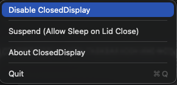

# ClosedDisplay

[](https://github.com/DINHDUY/mac-closed-display/actions/workflows/build.yml)
[](https://github.com/DINHDUY/mac-closed-display/actions/workflows/test.yml)
[](https://github.com/DINHDUY/mac-closed-display/actions/workflows/release.yml)
[](https://opensource.org/licenses/MIT)

A macOS utility that allows Apple Silicon Macs to continue running with the lid closed, without requiring an external display.

## Overview

ClosedDisplay uses a split-process architecture to safely override macOS power management while maintaining thermal safety:

- **Main App**: Monitors lid state, power sources, and thermal conditions
- **Helper Tool**: Executes privileged system commands (`pmset`) to prevent sleep
- **Safety**: Automatically reverts on thermal pressure to prevent hardware damage

## Use Cases

ClosedDisplay is perfect for scenarios where you need your Mac to keep working with the lid closed:

### 🤖 **AI Agent & Workflow Development**
Running multi-agent workflows or long-running AI tasks in the background? When you close your MacBook Pro lid, macOS typically shuts down network connectivity, interrupting your background processes. ClosedDisplay keeps your system active, maintaining network connections so your AI agents, workflows, and background tasks continue running uninterrupted.

### 🎵 **Media Server**
Use your MacBook as a music or media server in a closed, space-saving configuration while streaming content to other devices on your network.

### 💻 **Remote Development & SSH Sessions**
Keep your Mac accessible for remote SSH sessions, remote desktop connections, or as a development server while saving desk space with the lid closed.

### 📊 **Data Processing & Long-Running Tasks**
Run overnight data analysis, batch processing jobs, machine learning training, or rendering tasks without needing to keep the lid open or connect an external display.

### 🔄 **Background Synchronization**
Keep cloud syncing services (Time Machine backups, iCloud, Dropbox, etc.) running continuously without interruption, even with the lid closed.

### 🖥️ **Headless Server Mode**
Transform your MacBook into a headless server for development, testing, or home automation tasks while maintaining full processing power.

## Requirements

- macOS 14.0 or later
- Apple Silicon Mac (M1/M2/M3+)
- Administrator privileges (for initial setup)

## Installation

### Option 1: Download DMG (Recommended)

1. Download the latest `.dmg` from [GitHub Releases](https://github.com/DINHDUY/mac-closed-display/releases)
2. Open the DMG and drag **ClosedDisplay.app** to your Applications folder
3. Launch ClosedDisplay from Applications or Spotlight

### Option 2: Download TAR.GZ

1. Download the latest `.tar.gz` from [GitHub Releases](https://github.com/DINHDUY/mac-closed-display/releases)
2. Verify the checksum (optional):
   ```bash
   shasum -a 256 -c ClosedDisplay-v*.tar.gz.sha256
   ```
3. Extract and install:
   ```bash
   tar -xzf ClosedDisplay-v*.tar.gz
   cp -R ClosedDisplay-v*/ClosedDisplay.app /Applications/
   ```

### Option 3: Build from Source

```bash
swift build -c release
./scripts/build-app.sh  # creates ClosedDisplay.app
cp -R ClosedDisplay.app /Applications/
```

## User Guide

### Menu Bar Icon

Once running, ClosedDisplay lives in your menu bar. The icon shows the current state at a glance:

| Icon | State |
|------|-------|
| `●` (checkmark circle) | Active — sleep is prevented when lid is closed |
| `⏸` (pause circle) | Suspended — sleep is temporarily allowed |
| `○` (empty circle) | Disabled — ClosedDisplay is off |

Hover over the icon to see a status tooltip.

### Dropdown Menu

Click the menu bar icon to open the control menu:



| Menu Item | Description |
|-----------|-------------|
| **Enable / Disable ClosedDisplay** | Toggle the main feature on or off. When disabled, macOS resumes its default lid-close sleep behavior. |
| **Suspend (Allow Sleep on Lid Close)** | Temporarily pause ClosedDisplay without fully disabling it. Useful when you want to let the Mac sleep just this once. Click **Resume** to re-activate. |
| **About ClosedDisplay** | Shows version and app information. |
| **Quit** (`⌘Q`) | Exits the app and restores normal macOS sleep behavior. |

### Auto-Start on Login

To have ClosedDisplay launch automatically when you log in:

1. Open **System Settings → General → Login Items**
2. Click **+** and select `ClosedDisplay.app` from your Applications folder

## How It Works

1. **Lid Detection**: Monitors `AppleClamshellState` via IOKit Registry
2. **Sleep Prevention**: Executes `pmset -a disablesleep 1` via privileged helper
3. **Thermal Safety**: Watches `ProcessInfo.thermalState` and reverts on critical conditions
4. **Power Monitoring**: Tracks AC/battery transitions and reasserts settings as needed

## Safety Features

- **Thermal Watchdog**: Automatically reverts to normal sleep behavior if thermal state becomes serious or critical
- **Clean Shutdown**: Ensures all overrides are removed on exit
- **Power Awareness**: Adjusts behavior based on power source

## Testing

Run the test suite:

```bash
swift test
```

The test suite includes:
- Correctness tests (state transitions, lifecycle)
- Performance benchmarks (state change overhead)
- Property-based tests (state machine invariants)

## Contributing

Contributions are welcome! Please see [CONTRIBUTING.md](CONTRIBUTING.md) for details.

## Security

For security concerns, please see our [Security Policy](SECURITY.md).

## Changelog

See [CHANGELOG.md](CHANGELOG.md) for release history.

## Architecture

See [docs/closed-display.md](docs/closed-display.md) for detailed architecture documentation.

## License

See LICENSE file for details.
